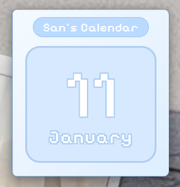

# 📅 San's Desktop Calendar Widget



> *A cute little calendar that lives on your desktop! ✨*

## What's This?

This is a tiny, adorable desktop calendar widget built with Electron! It sits on your desktop and shows you today's date in a super cute pixel-art style. Perfect for anyone who wants their desktop to feel a bit more ~aesthetic~ 💙

The widget features:
- 🎨 Soft blue gradient backgrounds
- 🎮 Pixelated font styling (giving major retro vibes)
- 🪟 Frameless, always-on-top window
- 📌 Draggable anywhere on your screen
- ⚡ Updates automatically to show the current date

## Getting Started

**Install dependencies:**
```bash
npm install
```

**Run the app:**
```bash
npm start
```

**Build for distribution:**
```bash
npm run build
```

## Customization Ideas

Want to make it *yours*? Try these:

- Change "San's Calendar" to your own name in `index.html`
- Pick different colors in `styles.css` 
- Adjust the window size in `main.js`
- Add day of the week display in `script.js`

## Tech Stack

- 🔧 Electron (for that sweet desktop app magic)
- 🎨 Custom CSS with Google Fonts
- ⚡ Vanilla JavaScript (keeping it simple!)

## License

Free to use, modify, and make your desktop cuter! 💕

---

*Made with love and pixels* ✨
